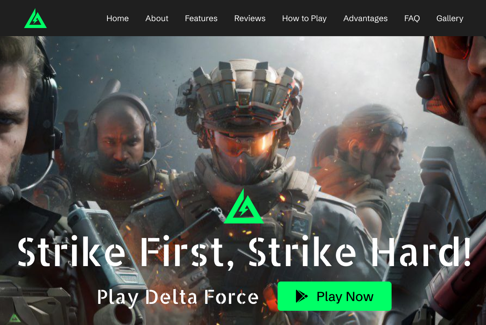

# Landing Page for Delta Force: Tactical Strike Team

This repository contains the source code for the **Delta Force: Tactical Strike
Team** landing page. The page provides information about the game, showcasing
its features, visuals, and relevant details.

## Live Demo

[View the Landing Page](https://valentyna88.github.io/stp-8307)

## Features

- **Modern UI Design** – A visually appealing and responsive layout tailored for
  the game.
- **Adaptive design** – Optimized for desktop and mobile devices.
- **Fast Loading** – Built using Vite for quick performance.
- **SCSS Styling** – Advanced styling with modular SCSS.

## Technologies Used

- **HTML** – Structuring web content
- **SCSS** – Styling with modular SCSS
- **JavaScript** – Adds interactivity
- **Vite** – Fast development and build tool

## Contributors

- [Valentyna Taranchuk](https://github.com/valentyna88)
- [Anna Taranchuk](https://github.com/aitmil)

---

🌐 **Thank you for visiting the Delta Force: Tactical Strike Team landing
page!**
